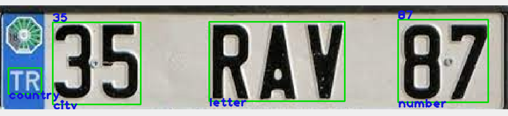

<!--  -->

Labelynx is a lightweight labeling tool that is written with Python and using mainly OpenCV



## Usage

`python labelynx.py <dataset_directory>`

Draw a rectangle on desired region, write the content and hit `Enter` to save annotation. Field names are filled based upon `template.json` file in `dataset` directory. İf all fields are done, drawing is disabled and go to next image.

Press `Esc` or `q` to exit. When started, continue from the last image.

## Installation

`conda env create -f environment.yml`

## Sample dataset tree

Under `dataset` find sample dataset ((e.g. license_plate)) tree structure

```
labelynx.py
dataset
|   license_plate
|   |   images/
|   |   template.json
```

## Shortcuts

* `Esc` : Exit
* `q` or 'Q' : Exit
* `a` or 'A' : Previous image
* `d` or 'D' : Next image
* `z` or 'Z' : Undo the last annotation
* `c` or 'C' : Clean all annotations
